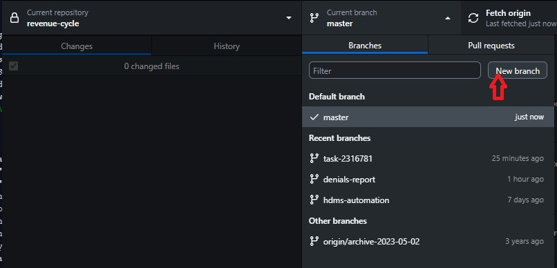
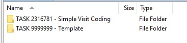
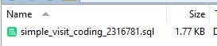
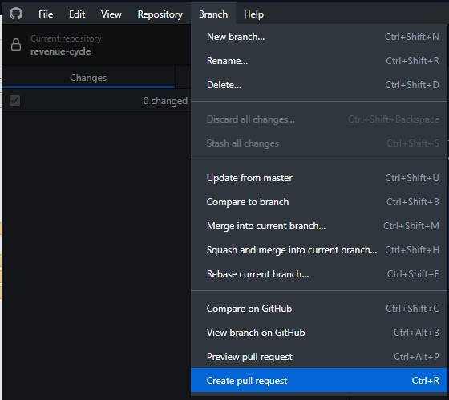
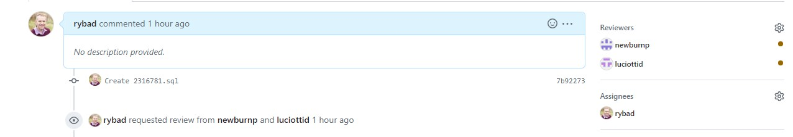

# Welcome to the Revenue Cycle Analytics Team Repo

This Github repository was created to act as the central repo for all thing Rev Cycle Analytics.

## Ad-Hoc Request Process

Below is a high-level walkthrough of the management, intake and cataloging of ad-hoc requests submitted to the RCA team.
1. Service Now Requests assigned to the *Revenue Cycle Analytics* group will be added to JIRA
2. Work will be assigned out based on content expertise and bandwidth to take on new work
3. Request will be coded using SQL against CDW
4. Completed code will be served up in a Pull Request to be approved and merged into Github
5. Naming conventions for code will contain a short description and the task number
	(ex. `simple_visit_coding_TASK_12345678.sql` )

## Step by Step instructions on using Github - [Recorded Step-by-step video](https://chop365-my.sharepoint.com/:v:/g/personal/rybad_chop_edu/EQ_St0QJUTJOvjeLz0jHpRgBX_PB9B4g6cQ3Ohqd0yY1Jw?referrer=Teams.TEAMS-ELECTRON&referrerScenario=MeetingChicletGetLink.view.view)
1.	Create new branch off the master branch in the `Revenue-Cycle` repository

    a. Click on "current branch" drop down and select "master" and allow things to sync.
    b. Click on "current branch" and select "New Branch"
    - Branch name should have the following format *TASK-XXXXXXX-Description*
      - TASK-XXXXXXX: Service Now task
      - Description: Shortened name of task
2.	Publish newly created branch to Github repo
3.	Create a new folder, locally, in the `Revenue-Cycle` folder that has a similar naming pattern as above TASK-XXXXXXX-Description*

4.	Develop sql code locally that will ultimately be reviewed.  Make sure code is saved in the newly created folder.

5.	Upon completion/need for review, commit code from local to new `TASK-XXXXXXX` branch with an appropriate commit message. Push changes to origin.

6.	Create Pull Request (PR) from `TASK-XXXXXXX` branch to `master`

	

    - Add a team member to review the code
    - Add yourself as the assignee
    - If urgent, add a comment to that effect so team is aware
	
	
